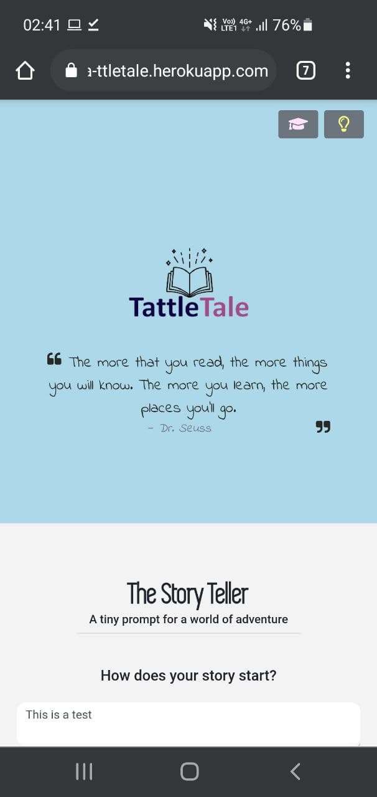

# TattleTale: AI-powered children's story generation
For iNTUition hackathon (27-28 Feb 2021)  
**Team members (That One): Leow Cong Sheng, Tay Kai Yang, Lin Min Htoo and Soo Jian Xian**

## Web-app
Check out our webapp here! [https://ta-ttletale.herokuapp.com/](https://ta-ttletale.herokuapp.com/)  

  

# What?  
We hope to increase the accessibility and exposure to reading in developing countries. 
 

# Why?  
Because, we strongly believe that education is a social leveller. Reading books and stories have tremendous impacts on cognitive and linguistics development which can be difficult to access for the illiterate. 
 

# How?  
We utilized the GPT2 language model for story generation through a simple, no-frill web application.  
Frontend: [https://github.com/xfated/intuitive](https://github.com/xfated/intuitive)   
Backend: [https://github.com/linminhtoo/that_one](https://github.com/xfated/intuitive) 